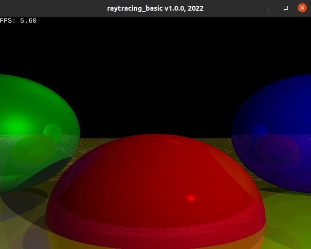

# raytracing_basic v1

## Description

Based on the Book [Computer Graphics from Scratch](https://gabrielgambetta.com/computer-graphics-from-scratch/index.html)




## Dependencies

* [Good Web Game](https://github.com/ggez/good-web-game)


## Build and run

```
cargo build --release

cargo run --release
```

## Controls

| Key(s)                | Action            |
| --------------------- | ----------------- |
| Up Arrow              | `Move Forward`    |
| Down Arrow            | `Move Backward`   |
| Left Arrow            | `Turn Left`       |
| Right Arrow           | `Turn Right`      |

## Author

* [Antonio Soares](https://github.com/ccie18473)

## License

This project is licensed under the [MIT] License - see the LICENSE.md file for details
